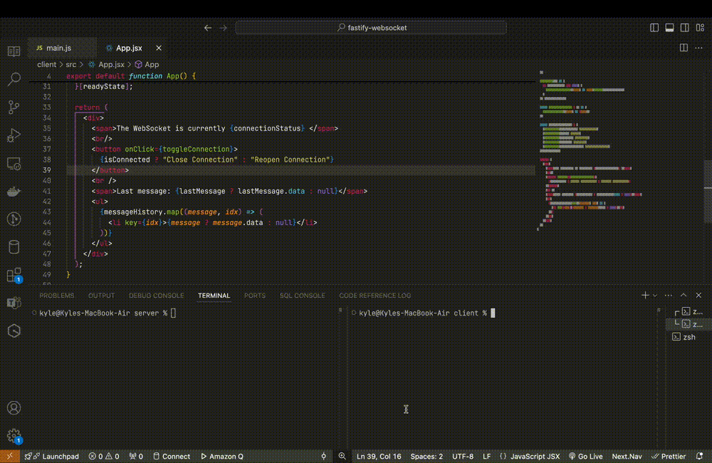

# Simple WebSocket Example with Fastify and React  

  

---

## Instructions  

Ensure you have the following installed:
- [Node.js](https://nodejs.org/) (v20 or higher)
- [npm](https://www.npmjs.com/)

1. **Open two terminals**:  
   - One for the `server`.  
   - One for the `client`.

2. **Install dependencies**:  
   Run the following command in both the `server` and `client` directories:  
   ```bash
   npm install
   ```

3. **Install dependencies**:  
   Use the following command in each terminal:
   ```bash
   npm run dev
   ```
